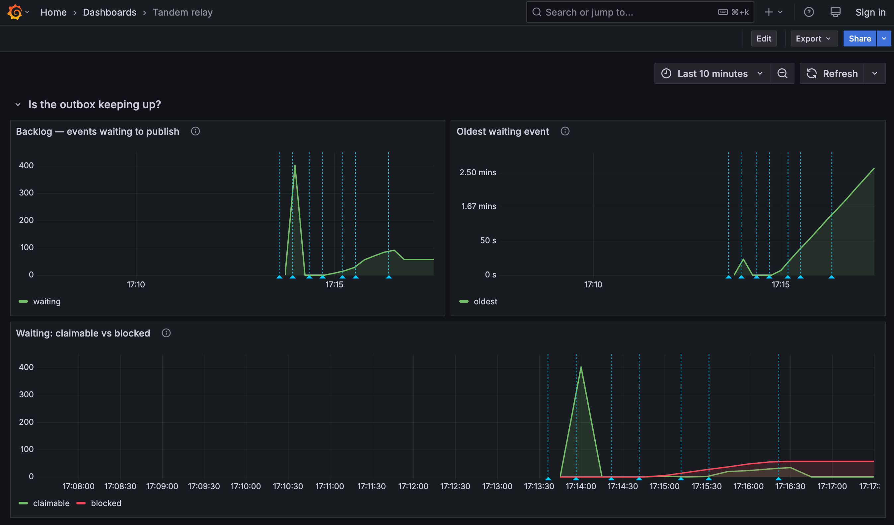

<div align="center">


# Tandem

**Reliable, strictly-ordered event delivery from your database to Apache Kafka — no CDC, no Kafka Connect, no two-phase commit.**

[](https://github.com/alirux/tandem/actions/workflows/ci.yml)
[](https://codecov.io/github/alirux/tandem)
[](LICENSE)
[](#)
[](https://central.sonatype.com/artifact/com.codingful/tandem-core)
[](https://github.com/alirux/tandem/releases)

</div>

## What is Tandem?

Tandem is a Java library that implements the **Transactional Outbox Pattern**. You insert an
event into an `outbox` table **inside the same transaction** that mutates your domain — so the
write is atomic by your database's ACID guarantees, with no dual-write and no distributed
transaction. A separate **relay** then polls the outbox and publishes to Kafka, at-least-once,
preserving per-aggregate ordering.

It targets the gap between a **hand-rolled outbox** (correct, but every subtle trap is yours to
get right) and **Debezium/CDC** (powerful, but a separate distributed system to operate):
no extra infrastructure — just your relational database and Kafka — with the correctness traps
already handled.

## Why Tandem?

The classic **double write** — write to the DB, then publish to Kafka as two non-atomic steps —
diverges permanently on partial failure. Tandem removes the dual-write:

```
BEGIN TX
  UPDATE aggregate SET version = version + 1 WHERE id = ? FOR UPDATE
  INSERT INTO tandem_outbox (aggregate_id, type, seq, payload, ...)
COMMIT TX                  ← both or neither, guaranteed by the DB
```

If the relay crashes after publishing but before marking the row done, it republishes — a
**duplicate** (manageable), never a **divergence**.

## Key features

- **Per-aggregate happens-before ordering** — strict order within an `aggregate_id`, full
  parallelism across aggregates (the Kafka partition-key model, enforced end to end).
- **At-least-once relay** with sharded `SKIP LOCKED` polling, lease-based failover, exponential
  backoff, and poison-message isolation (a stuck event blocks only its aggregate).
- **CloudEvents by default** — messages are published using the CNCF CloudEvents envelope
  (binary mode), interoperable with the wider ecosystem.
- **First-class, per-aggregate replay** — re-publish a single aggregate's history through a
  programmatic Java API (`ReplayService`).
- **Pluggable metrics port** — `TandemMetrics` in `tandem-core` reports published and retried counts,
  config-validation failures, and the signals an operator actually alerts on: how many events are
  waiting, how long the oldest has been waiting, how many are permanently failed right now, how many
  later events are blocked behind one of those failures (queued but unclaimable until it is resolved —
  reported separately so it never gets confused with a relay that is merely falling behind), how many
  relay workers are alive, and — under `LEASE` coordination — how many buckets have work waiting but
  no live owner. All of it is read periodically and **only when an adapter is wired**, so a no-op
  default costs nothing. `tandem-micrometer` binds all of it to a real Micrometer `MeterRegistry`,
  autoconfigured by `tandem-spring-relay` the moment both are on the classpath.
- **Embedded or standalone, single or multi-instance** — the relay runs in your app or in a separate
  process you assemble yourself, and coordinates one or many concurrent instances via a declared
  mode: `SINGLE` (one instance owns all buckets, zero cost) or `LEASE` (lease-partitioned ownership
  for a horizontally-scaled client or multiple relay processes). Both modes are implemented and
  tested. Only the outbox INSERT must live in the client, which stays dependency-light.
- **Framework-agnostic core** — works with plain Java and no container. Spring Boot autoconfiguration is
  implemented for both the **write side** (`tandem-spring-producer` — the four usage tiers over the outbox
  INSERT) and the **relay** (`tandem-spring-relay` — started and stopped with the application), so a Spring
  app needs no manual wiring (see the [Spring sample](#try-it)). One artifact per module serves **Boot 3.x
  and 4.x** alike — Spring is `compileOnly`, so your app's own version binds at runtime, and `./gradlew
  check` runs the autoconfiguration tests against both lines. Plain-Java wiring stays available (see
  [Usage](#usage)).

## Architecture at a glance

```
┌───────────────────── Client application ──────────────────────┐
│  Domain TX --same TX--> INSERT outbox row (PostgreSQL)        │
└───────────────────────────────┬───────────────────────────────┘
                                │  the DB is the only coordination point
                                ▼
           ┌──── Relay (embedded or standalone) ────┐
           │  sharded poll -> publish -> mark DONE  │
           └────────────────────────────────────────┘
                                │
                                ▼
              Apache Kafka (keyed by aggregate_id)
```

Only the **write-side** must run in the client; the relay and housekeeping are DB-coordinated and
can be deployed independently. See [HLD §3.2](docs/HLD.md).

## Add the dependency

Tandem is published to Maven Central under the `com.codingful` group. Import the
[BOM](CONTRIBUTING.md#project-layout) to keep module versions aligned, then declare only the
modules you need (no per-module version). Use the current version from
[Maven Central](https://central.sonatype.com/artifact/com.codingful/tandem-core) (also linked from
the badge above) or the [Releases](https://github.com/alirux/tandem/releases) page in place of
`x.y.z` below.

**Gradle (Kotlin DSL)**

```kotlin
dependencies {
    implementation(platform("com.codingful:tandem-bom:x.y.z"))
    implementation("com.codingful:tandem-jdbc")     // write-side + relay engine (PostgreSQL)
    implementation("com.codingful:tandem-kafka")    // Kafka publish + CloudEvents binding
    testImplementation("com.codingful:tandem-test") // in-memory doubles + Testcontainers helper
}
```

**Maven**

```xml
<dependencyManagement>
  <dependencies>
    <dependency>
      <groupId>com.codingful</groupId>
      <artifactId>tandem-bom</artifactId>
      <version>x.y.z</version>
      <type>pom</type>
      <scope>import</scope>
    </dependency>
  </dependencies>
</dependencyManagement>

<dependencies>
  <dependency>
    <groupId>com.codingful</groupId>
    <artifactId>tandem-jdbc</artifactId>
  </dependency>
  <dependency>
    <groupId>com.codingful</groupId>
    <artifactId>tandem-kafka</artifactId>
  </dependency>
</dependencies>
```

The write-side alone (`tandem-jdbc`) pulls no Kafka dependency; add `tandem-kafka` only where the
relay runs. On Spring Boot, take `tandem-spring-producer` where you write and `tandem-spring-relay`
where the relay runs — each brings its own tier of the stack and leaves Spring itself to your
application's versions. See [CONTRIBUTING.md](CONTRIBUTING.md#project-layout) for the full module
list. What changed between versions, breaking changes included, is on the
[Releases](https://github.com/alirux/tandem/releases) page.

### Spring Boot compatibility

`tandem-spring-producer` and `tandem-spring-relay` ship **one artifact for both Spring Boot
generations** — Spring is `compileOnly`, so your application's own Boot BOM controls the runtime
version, and Tandem never appears in your dependency tree.

| | Spring Boot |
|---|---|
| Compiled against (baseline) | 3.3.5 |
| Verified via `bootFourTest` | 4.1.0 |

Any Boot 3.x ≥ 3.3.5 or Boot 4.x ≥ 4.1.0 is expected to work; CI pins and tests exactly these two
versions, not every intermediate release.

## Usage

**Write-side** — insert the event inside your own transaction (the relay never runs here):

```java
@Transactional
public Order placeOrder(Order order) {
    orderRepository.save(order);
    outboxRepository.insert(OutboxMessage.builder()
        .aggregateId(order.id())
        .aggregateType("Order")
        .type("com.acme.order.placed")
        .seq(order.version())          // your aggregate owns the sequence number
        .payload(serialize(order))     // plain write-side takes bytes; the Spring producer tiers accept an object
        .contentType("application/json")
        .build());
    return order;
}
```

**Relay** — wire it directly (no Spring required); it polls the outbox and publishes to Kafka,
preserving per-aggregate order:

```java
OutboxRepository repo = new JdbcOutboxRepository(dataSource, /* bucketCount */ 256);

// Startup guard: fail fast if the write-side and the relay disagree on bucketCount. A mismatch
// would route rows into buckets no worker polls — delivery stops with no error — so the first
// side to start records the value and every later start validates against it. Run it once, on a
// plain DataSource. (The write-side and relay usually run in separate processes; call it in each.)
BucketCountGuard.check(dataSource, /* bucketCount */ 256);   // must match the repository above

OutboxStore      store      = new JdbcOutboxStore(dataSource, /* maxAttempts */ 10);
TopicRouter      router     = TopicRouter.kebabWithSuffix("-topic");
OutboxDispatcher dispatcher = new KafkaRelay(kafkaProducerConfig, router, KafkaRelayConfig.of("/tandem/orders"));
WorkerPool       relay      = new WorkerPool(store, dispatcher, RelayConfig.defaults());
relay.start();   // on shutdown: relay.stop();  (in-flight rows recovered by lease)
```

Spring users write none of the above. `tandem-spring-producer` autoconfigures the write side (running
the bucket-count guard for you) and adds the `TransactionalOutboxTemplate`, the `@TransactionalOutbox`
annotation, and the Spring application-events tier; `tandem-spring-relay` autoconfigures the relay and
starts it with the application. Both wire from `tandem.*` properties, with IDE completion and hover help
from the metadata each module ships; each also ships a commented reference configuration
(`tandem-producer-reference.yml`, `tandem-relay-reference.yml`) listing every key it binds with its
default. See the [Spring sample](#try-it), [LLD-spring-producer.md](docs/LLD-spring-producer.md) and
[LLD-spring-config.md](docs/LLD-spring-config.md).

## Logging

Tandem ships **no logging configuration** — routing and formatting are the consuming application's
job, not the library's:

| Module | Logs via | To see its logs |
|---|---|---|
| `tandem-jdbc` (relay lifecycle, claim/reclaim cycles) | `java.lang.System.Logger` (JDK built-in, zero dependencies) | Needs a bridge — see below |
| `tandem-kafka` (publish/encode/send failures) | SLF4J | Nothing to do: picked up by the same SLF4J binding your Kafka client already uses |
| `tandem-core`, `tandem-test` | Nothing — no I/O, errors surface as exceptions | — |

Bridge `System.Logger` to your backend with one dependency — no code, it self-registers via
`ServiceLoader`:

```kotlin
runtimeOnly("org.slf4j:slf4j-jdk-platform-logging:2.0.16")
```

`INFO` covers relay lifecycle; `DEBUG` covers per-cycle detail (claims, reclaims) for
troubleshooting a stalled relay — set on the `com.codingful.tandem.jdbc` and
`com.codingful.tandem.kafka` logger names. Full policy, including a bridge-free alternative and
what Tandem never logs: [HLD-logging.md](docs/HLD-logging.md).

## Try it

`tandem-sample` is a self-contained tutorial you can run immediately — no Maven Central required.
It starts real PostgreSQL and Kafka containers via Testcontainers, inserts 5 outbox events for two
interleaved orders, and verifies that the relay delivers them in per-aggregate sequence order.

**Prerequisites:** Java 17+, Docker (Docker Desktop or Colima).

```bash
# macOS / Linux
git clone https://github.com/alirux/tandem.git
cd tandem
./tandem-sample/run.sh
```

```cmd
:: Windows
git clone https://github.com/alirux/tandem.git
cd tandem
tandem-sample\run.cmd
```

The script prints JDBC and Kafka connection details so you can connect external clients while the
demo is running. Containers stay alive until you press ENTER.

For the **Spring Boot** write-side experience, run the Spring sample instead — it boots a Spring
application against a Testcontainers PostgreSQL, writes events through the `@TransactionalOutbox`,
Template and Spring-events tiers, and delivers them to Kafka in per-aggregate order:

```bash
# macOS / Linux
./tandem-sample-spring/run.sh
```

```cmd
:: Windows
tandem-sample-spring\run.cmd
```

The Spring sample also demonstrates the Admin API's read endpoints (`tandem.admin.enabled: true`
in its `application.yml`) against the same outbox it just wrote to. Once the demo narration
finishes, the app keeps running as a web server (Ctrl+C to stop) — try:

```bash
curl http://localhost:8080/tandem/admin/v1/outbox/summary
curl http://localhost:8080/tandem/admin/v1/outbox/messages
curl http://localhost:8080/tandem/admin/v1/outbox/messages/1
```

To see the relay's own metrics rather than take them on faith, `tandem-benchmark`'s
`metricsDashboardDemo` runs a real Micrometer → Prometheus → Grafana pipeline through seven
scripted phases — no relay running, a drain, steady load, a failing aggregate, a second instance
joining, a crash with rows in flight, recovery — and holds the dashboard open so every signal
`TandemMetrics` reports can be read on a live graph instead of asserted in a test:

```bash
./gradlew :tandem-benchmark:metricsDashboardDemo
```

<p align="center"></p>

Needs Docker; the first run pulls the Prometheus and Grafana images. Press Enter to shut the stack
down, or pass `--args="--hold=<seconds>"` to close it automatically instead. See
[LLD-benchmark.md §6.3](docs/LLD-benchmark.md) for what each panel means, including the alerting
gap the first real runs found — the reason `blocked.count` exists.

## Documentation

| Document | Contents |
|---|---|
| [HLD.md](docs/HLD.md) | High-Level Design — architecture, decisions, data model, flow |
| [LLD-base.md](docs/LLD-base.md) | Shared build/package conventions |
| [HLD-cloudevents.md](docs/HLD-cloudevents.md) | CloudEvents publication format |
| [HLD-attempt-archive.md](docs/HLD-attempt-archive.md) | Forensic per-attempt archive |
| [HLD-tracing.md](docs/HLD-tracing.md) | Trace & correlation propagation |
| [LLD-micrometer.md](docs/LLD-micrometer.md) | Micrometer metrics adapter — meter mapping, gauge registration mechanics, Spring autoconfiguration |
| [HLD-logging.md](docs/HLD-logging.md) | Logging posture — per-module logging API, level policy, what is never logged |
| [LLD-spring-config.md](docs/LLD-spring-config.md) | Spring modules & configuration contract — module split, property contract, autoconfiguration (not the write-side ergonomics) |
| [LLD-spring-producer.md](docs/LLD-spring-producer.md) | Spring write-side ergonomics — the Template, `@TransactionalOutbox`, and Spring-events tiers, plus optional payload serialization |
| [LLD-bucket-count-guard.md](docs/LLD-bucket-count-guard.md) | Guard against a divergent bucket count between write-side and relay (core strategy + port, JDBC adapter) |
| [HLD-admin-api.md](docs/HLD-admin-api.md) · [admin-api.openapi.yaml](docs/admin-api.openapi.yaml) | Admin API design + OpenAPI contract |
| [HLD-load-testing.md](docs/HLD-load-testing.md) · [LLD-benchmark.md](docs/LLD-benchmark.md) | Throughput/latency verification plan + the `tandem-benchmark` harness that implements it |
| [causal-ordering.md](docs/causal-ordering.md) | Cross-aggregate causal ordering (deep-dive) |
| [dispatch-latency.md](docs/dispatch-latency.md) | Commit-to-publish latency: where it comes from, and the post-commit wakeup options (analysis) |
| [comparison.md](docs/comparison.md) | Comparison with Debezium, Eventuate Tram, Spring Modulith |
| [open-questions-lld.md](docs/open-questions-lld.md) | Tracked gaps to resolve before the LLDs |
| [IMPLEMENTATION-PLAN-basic-round.md](docs/IMPLEMENTATION-PLAN-basic-round.md) | Execution plan, scope fence, and per-module done-ness for the first milestone |
| [IMPLEMENTATION-PLAN-embedded-lease.md](docs/IMPLEMENTATION-PLAN-embedded-lease.md) | Plan for the `LEASE` multi-instance coordination opt-in (embedded-multi-replica or standalone) |

## Design principles

- **Pareto's Law** — simple for ≥ 80% of use cases; minority-case complexity is opt-in or out of scope.
- **Hexagonal (Ports & Adapters)** — a pure core defines ports; technology modules are adapters.
- **Minimal client footprint** — the part you import has minimal, ideally zero, external dependencies.
- **API-first** — external APIs are defined contract-first (OpenAPI) before implementation.

## Building & testing

Gradle (Kotlin DSL), Java 17 toolchain (auto-provisioned). Use the wrapper:

```bash
./gradlew test     # unit tests only — no Docker required
./gradlew check    # full verification, incl. @Tag("integration") Testcontainers tests (need Docker)
./gradlew build    # compile + unit tests + assemble
```

Integration tests spin up real PostgreSQL and Kafka via Testcontainers, so they need a running
Docker daemon (Docker Desktop or Colima); without one, run `./gradlew check -x integrationTest`.
Per-module coverage is written to each module's `build/reports/jacoco/test/jacocoTestReport.xml`.
For a single project-wide report that also credits cross-module coverage (e.g. a `tandem-jdbc`
integration test exercising a `tandem-core` class) to the class that owns it, run:

```bash
./gradlew :tandem-coverage:aggregatedCoverageReport   # unit + integration + e2e, all modules
```

It lands in `tandem-coverage/build/reports/jacoco/aggregated/` (HTML + XML) and is the report CI
uploads to Codecov.

## Build & license

- **Build:** Gradle · **Java:** 17+ · **Published to:** Maven Central (`com.codingful`)
- **License:** Apache 2.0

Tandem publishes standard, non-shaded JARs — third-party libraries are not bundled and
are resolved separately from Maven Central under their own licenses. The runtime footprint
is listed in [THIRD-PARTY-NOTICES.md](THIRD-PARTY-NOTICES.md).

Contributor conventions are in [AGENTS.md](AGENTS.md).

## Known issues & limitations

Behaviours of what **is** shipped that can surprise you in production. Each one is a deliberate
trade-off or a tracked gap — none is a bug report. (For what is *not yet* shipped, see
[Future work](#future-work) below.)

- **PostgreSQL only today.** The shipped schema, the claim/lease SQL, and every integration test
  target PostgreSQL — there is no MySQL baseline DDL and no MySQL engine variant in any released
  version, so running Tandem against MySQL is not possible today.

- **A permanently failed event stops its aggregate.** The claim query only takes a row when no
  earlier row of the same `aggregate_id` is still PENDING, IN_FLIGHT or FAILED — that is what
  preserves per-aggregate order, and it means a row that exhausts `maxAttempts` (default 10, roughly
  7 minutes with the jittered backoff ladder) leaves every later event of that aggregate
  undelivered. Other aggregates are unaffected: the blast radius is one aggregate, by design. The
  `TandemMetrics` `blocked.count` gauge reports how many later events are queued behind such a
  failure, so the blast radius is observable without querying the table directly — but it stays
  above zero, and a naive alert on backlog age alone will misread this as the relay stalling, until
  the failure is resolved.
  **Resolution:** there is no supported operator action today — inspect `last_error` and move the
  row to `status = 4` (DISCARDED) with SQL to unblock the chain.

- **Ordering within an aggregate is only as good as your write-side.** Tandem relays rows in `id`
  order and `UNIQUE (aggregate_id, seq)` rejects a duplicate `seq`, but neither *creates* order: if
  two transactions insert for the same aggregate concurrently and the one with the lower `id` commits
  second, the relay will already have published the later event. The contract is that writers to one
  aggregate are serialized — a `SELECT … FOR UPDATE` on the aggregate row, or an optimistic version
  check — and that `seq` is that aggregate's version. See [HLD §4.2](docs/HLD.md).

- **Duplicates are expected, reordering is not.** At-least-once means a crash between the Kafka ack
  and the mark-DONE republishes the event. Consumers must be idempotent; this is the price the outbox
  pattern pays to never diverge.

- **A reclaimed row has a brief double-ownership window.** `markDone`/`markForRetry`/`markFailed`
  update by `id` without an `AND locked_by = :me` fence, so after a lease expiry and reclaim a late
  write from the previous owner can still land on a row another instance now owns. The effect is
  bounded to at most a duplicate publish — never a reorder — which is why the fence is tracked as
  hardening rather than a fix ([IMPLEMENTATION-PLAN-embedded-lease.md](docs/IMPLEMENTATION-PLAN-embedded-lease.md) §6).

- **Idle latency is bounded by `pollInterval`, not by the commit.** There is no post-commit wakeup
  yet: a bucket that was drained waits on average `pollInterval / 2` (≈ 50 ms at the 100 ms default,
  100 ms worst case) before the new row is discovered. Under sustained load the cost is ≈ 0 — the
  worker loop only sleeps when a claim comes back empty. Lowering `pollInterval` trades this against
  idle query load across all instances and workers; the full analysis, and the wakeup options, are in
  [dispatch-latency.md](docs/dispatch-latency.md).

- **`bucketCount` is immutable after the first deploy.** Changing it re-maps aggregates onto
  different buckets and would split one aggregate's events across workers, so the startup guard
  refuses a mismatch rather than accepting it — and re-sharding an existing outbox is not supported.
  Pick `B` once (default 256, comfortable to well past the parallelism most deployments need).

- **Cleanup and lease reclaim are not bucket-scoped.** Every relay instance scans the whole
  `tandem_outbox` for expired leases (every 5 s) and for terminal rows past the retention window
  (every 15 min, default retention 14 days). It is safe — the work is idempotent and keyed by
  `id`/`status` — just redundant under `LEASE` with N instances ([LLD-jdbc §3.2/§3.7](docs/LLD-jdbc.md)).
  Terminal rows also stay in the table for the whole retention window, which is what keeps the table
  large enough to be worth an index-only dispatch scan.

- **No runtime controls.** Configuration is read at startup: there is no pause/resume, and no way to
  retune the relay without restarting the process. Today, taking a misbehaving relay out of the
  picture means stopping it — which also stops the buckets that were perfectly healthy.

- **Blocking JDBC only.** The relay is a thread-per-worker pool over a `DataSource`; R2DBC and
  reactive pipelines are not supported.

## Future work

Not yet shipped, in no particular order:

- **`tandem-relay`** — a prebuilt, standalone relay deployable. Today you assemble the relay
  process yourself (plain Java or Spring); see [Usage](#usage).
- **`tandem-admin`** — an API-first REST Admin API to inspect outbox state and replay failed
  messages. The read side (health summary, search, message detail) ships today, off by default
  (`tandem.admin.enabled=true`); replay, discard, and relay pause/resume are still to come. Contract:
  [HLD-admin-api.md](docs/HLD-admin-api.md) · [admin-api.openapi.yaml](docs/admin-api.openapi.yaml).
- **Optional, opt-in capabilities** — cross-aggregate causal ordering via Lamport clocks, a
  forensic per-attempt archive, and W3C trace/correlation propagation. Each has a design document
  ([causal-ordering.md](docs/causal-ordering.md), [HLD-attempt-archive.md](docs/HLD-attempt-archive.md),
  [HLD-tracing.md](docs/HLD-tracing.md)) and a port already published in `tandem-core`
  (`AttemptRecorder`, `TracePropagator`, `CausalContext`, plus the `AttemptStatus` and
  `AttemptOutcome` types) that resolves to a no-op today — visible in IDE autocomplete, but nothing
  references them yet. Treat them as reserved API: off by default *by design*, so adopting one will
  stay a zero-cost, per-capability opt-in.
- **MySQL support.** The claim strategy is already portable (`SELECT ... FOR UPDATE SKIP LOCKED`,
  supported by MySQL 8.0+), so this is a deliberate roadmap item rather than an architectural
  obstacle — but until it lands, PostgreSQL is the only supported database.
- **`tandem-micrometer`.** Implemented and tested; release to Maven Central is still pending.

The full per-module status is in [CONTRIBUTING.md](CONTRIBUTING.md#project-layout).
